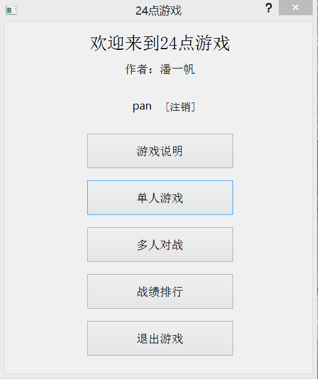
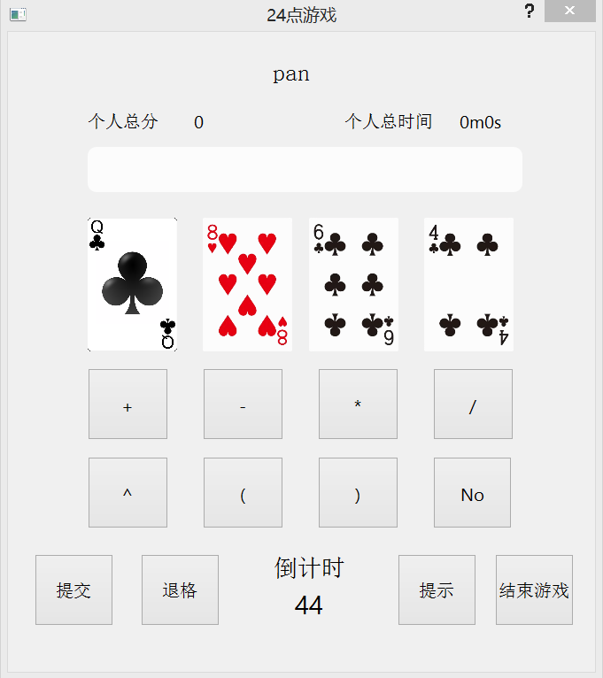

# 24Game

利用C++的QT框架实现了一个24点小游戏，拥有完善的用户注册登录机制、计时计分机制、排名pk机制，支持单人/多人游戏，运行截图如下所示：

## 主界面

## 单人游戏界面

## 运行方式

### 方式一

直接运行Release文件夹内的24Game.exe

### 方式二

利用Qt官方IDE [Qt Creator](https://www.qt.io/qt-features-libraries-apis-tools-and-ide/#ide) 导入24Game.pro，然后在IDE内运行